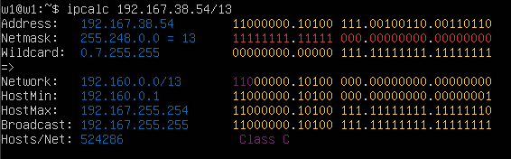
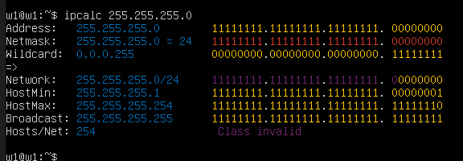
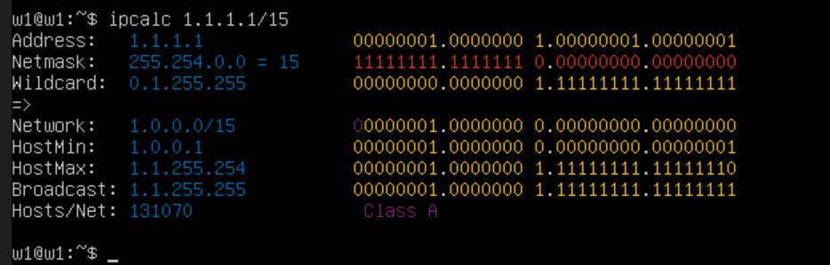

# Отчёт по проекту DO2_LinuxNetwork

## Part 1. Инструмент ipcalc

### 1.1. Сети и маски

1. **Адрес сети 192.167.38.54/13**  
     
   Адрес сети: `192.160.0.0/13`

2. **Перевод масок**  
   - Маска `255.255.255.0`  
       
     Префиксная запись: `/24`  
     Двоичная запись: `11111111.11111111.11111111.00000000`  
   - Маска `/15`  
       
     Обычная запись: `255.254.0.0`  
     Двоичная запись: `11111111.11111110.00000000.00000000`  
   - Маска `11111111.11111111.11111111.11110000`  
       
     Обычная запись: `255.255.255.240`  
     Префиксная запись: `/28`

3. **Минимальный и максимальный хост в сети 12.167.38.4**  
   - Маска `/8`, `/16`, `/23` (все на одном скриншоте)  
       
     HostMin и HostMax:  
       * /8: `12.0.0.1` – `12.255.255.254`  
       * /16: `12.167.0.1` – `12.167.255.254`  
       * /23: `12.167.38.1` – `12.167.39.254`  
   - Маска `/4`  
       
     HostMin: `0.0.0.1`  
     HostMax: `15.255.255.254`

### 1.2. localhost

Определение, можно ли обратиться к приложению, работающему на localhost, с указанных IP:

- `194.34.23.100` — нет (не в диапазоне `127.0.0.0/8`)
- `127.0.0.2` — да (принадлежит `127.0.0.0/8`)
- `127.1.0.1` — да (принадлежит `127.0.0.0/8`)
- `128.0.0.1` — нет (не в диапазоне `127.0.0.0/8`)

### 1.3. Диапазоны и сегменты сетей

1. **Публичные и частные IP**  

   | IP-адрес          | Тип          |
   |-------------------|--------------|
   | `10.0.0.45`       | частный      |
   | `134.43.0.2`      | публичный    |
   | `192.168.4.2`     | частный      |
   | `172.20.250.4`    | частный      |
   | `172.0.2.1`       | публичный    |
   | `192.172.0.1`     | публичный    |
   | `172.68.0.2`      | публичный    |
   | `172.16.255.255`  | частный      |
   | `10.10.10.10`     | частный      |
   | `192.169.168.1`   | публичный    |

2. **Возможные IP-адреса шлюза для сети 10.10.0.0/18**  

   Сеть `10.10.0.0/18` занимает диапазон `10.10.0.1 – 10.10.63.254`.  
   Из предложенных адресов подходят:
   - `10.10.0.2`
   - `10.10.10.10`
   - `10.10.1.255`  
   Остальные (`10.0.0.1`, `10.10.100.1`) не входят в эту сеть.

---

## Part 2. Статическая маршрутизация между двумя машинами

### Просмотр сетевых интерфейсов (до настройки)

- **ws1** (адрес ещё не задан, на интерфейсе enp0s3 виден 127.0.0.1/8 — это некорректно, требуется настройка)  
  

### Исходный файл netplan (с dhcp)

- **ws1** (файл `/etc/netplan/00-installer-config.yaml` до изменений)  
  

### Ошибка при применении неправильного YAML

- **ws1** (попытка применить конфигурацию с ошибкой)  
  

### Настройка адресов

После исправления синтаксиса и применения конфигурации:

- **ws1** (адрес 192.168.100.10/16)  
  

- **ws2** (адрес 172.24.116.8/12; на том же скриншоте ниже виден повторный вывод для ws1)  
  

### 2.1. Добавление статического маршрута вручную

- На **ws2** добавлен маршрут до хоста ws1 (192.168.100.10/32) и выполнен пинг на этот адрес, а затем пинг с ws2 на ws1 (обратный) — все команды и результаты видны на одном скриншоте.  
  

### 2.2. Добавление статического маршрута с сохранением

После перезагрузки машин и добавления статических маршрутов в файлы netplan (скриншоты содержимого файлов отсутствуют, будут добавлены позже) таблицы маршрутизации приняли следующий вид:

- **Таблица маршрутизации на ws1** (после apply)  
    
  (верхняя часть: 172.16.0.0/12 — это сеть ws2, и статический маршрут до 192.168.100.10)

- **Таблица маршрутизации на ws2** (после apply)  
    
  (нижняя часть: статический маршрут до 172.24.116.8 и сеть 192.168.0.0/16)

> **Примечание:** для полного выполнения пункта 2.2 необходимы скриншоты содержимого файлов `/etc/netplan/00-installer-config.yaml` на обеих машинах с добавленными маршрутами. Они будут добавлены после создания.

---

## Part 3. Утилита iperf3

### 3.1. Скорость соединения

Перевод единиц измерения скорости передачи данных:

- **8 Mbps в MB/s**:  
  8 Mbps = 8 / 8 = 1 MB/s (поскольку 1 байт = 8 бит).

- **100 MB/s в Kbps**:  
  100 MB/s = 100 * 8 = 800 Mbps = 800 * 1000 = 800 000 Kbps (в десятичной системе, где 1 Mbps = 1000 Kbps).

- **1 Gbps в Mbps**:  
  1 Gbps = 1000 Mbps.

### 3.2. Утилита iperf3

> Скриншоты с запуском сервера и клиента iperf3 пока отсутствуют. Они будут добавлены после выполнения замера скорости.

---

*Далее будут добавлены части 4–8.*